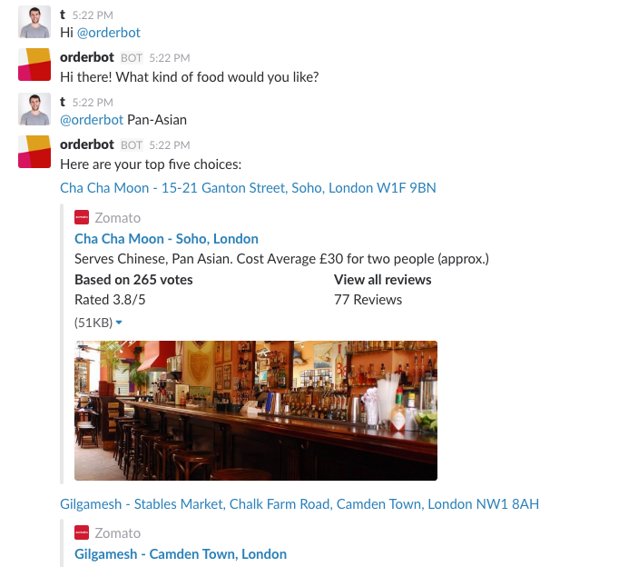

## Introduction

This is a simple Slack chat bot integration. The chatbot was designed to provide the Top 5 restaurant choices for a cuisine of the caller's choosing. The server on which the chatbot runs can be loaded locally and added to a slack team.

This project was made using the [Botmaster](https://github.com/botmasterai/botmaster) framework.

## Install Instructions

### Loading the server

- Fork and Clone Repo to local machine.   
- Install [Node](
https://nodejs.org/en/download/) and [NPM](http://blog.npmjs.org/post/85484771375/how-to-install-npm).   
- Run `npm install`.
- Update Slack API keys.  
- Run the local tunnel `lt -p 3000 -s botmastersubdomain`.
- In another console window, run `node index.js`.
- The server is hosted on localhost:3000 by default.

### Integration with Slack

- Invite @orderbot into your channel!

## Communicating with OrderBot in slack

